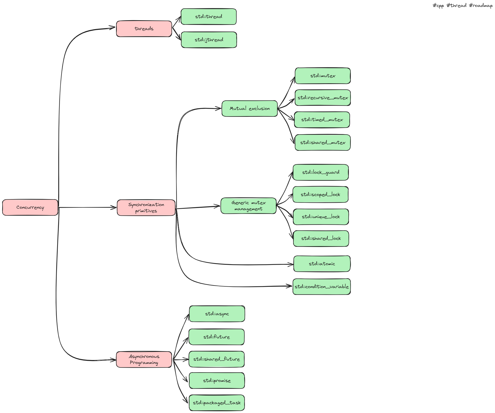

[Learn Multithreading with Modern C++](https://www.udemy.com/course/learn-modern-cplusplus-concurrency/)
[Cource Source code](https://github.com/JamesRaynard/Multithreading-Cpp-Course)

 - Section 1. Introduction
 - [Section 2. Review of Modern C++ Features](./Theory/Section%202.%20Review%20of%20Modern%20C++%20Features.md)
 - [Section 3. Introduction to Concurrency](./Theory/Section%203.%20Introduction%20to%20Concurrency.md)
 - [Section 4. Getting Started with Threads](./Theory/Section%204.%20Getting%20Started%20with%20Threads.md)
 - [Section 5. Working with shared data](./Theory/Section%205.%20Working%20with%20shared%20data.md)
 - [Section 6. Thread Synchronization](./Theory/Section%206.%20Thread%20Synchronization.md)
 - [Section 7. Atomic types](./Theory/Section%207.%20Atomic%20types.md)
 - [Section 8. Asynchronous Programming](./Theory/Section%208.%20Asynchronous%20Programming.md)
 - [Section 9. Parallelism](./Theory/Section%209.%20Parallelism.md)
 - [Section 10. Practical Data Structures and Concurrent Programming](./Theory/Section%2010.%20Practical%20Data%20Structures%20and%20Concurrent%20Programming.md)
 - Section 11. Multithreading Resources
 - Section 12. Add finally...